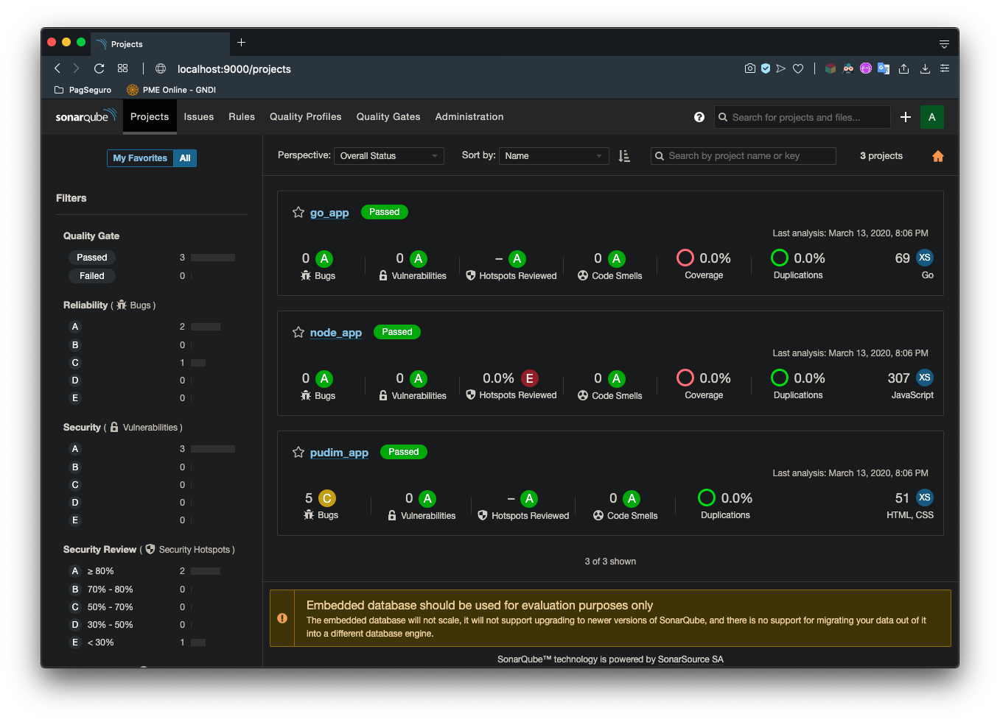
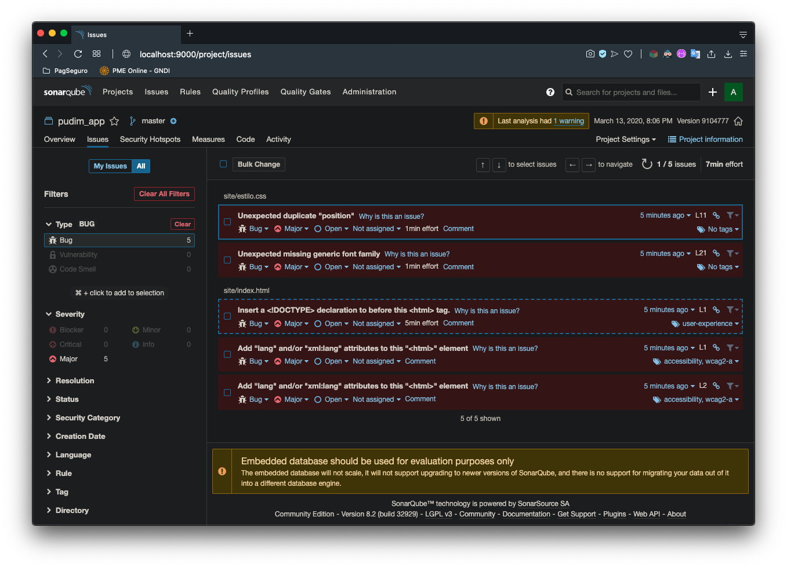

# Build Sonar image 

```bash
docker build -it sonar
```

# Create sonar-project.properties

```bash
cd node_app/
bash entrypoint.sh
```

# Exec docker-compose stack

```bash 
docker-compose up --force-recreate
```




